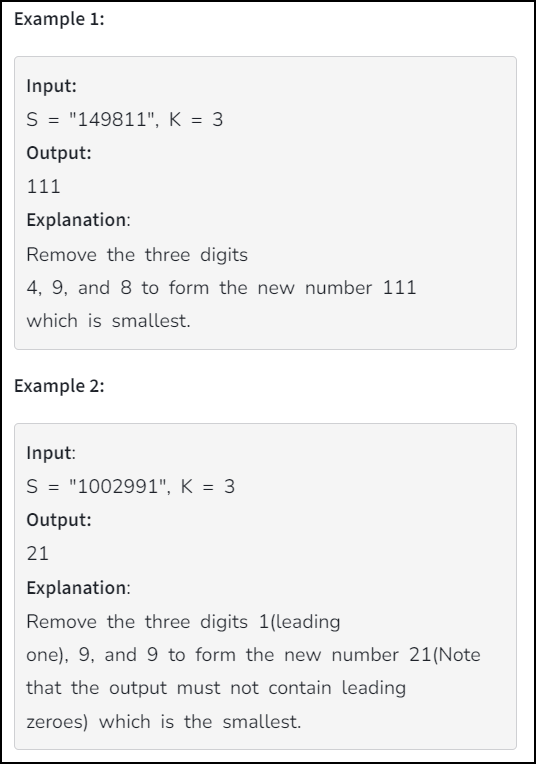
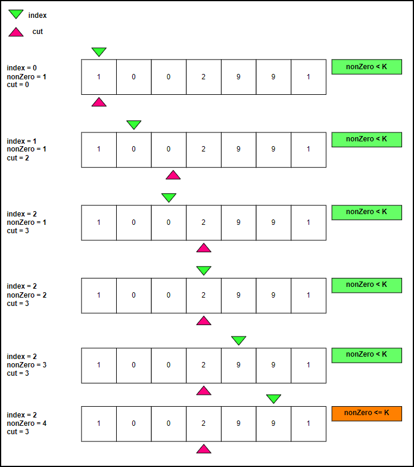

**Problem : Remove K Digits**

Topic : Stack

Company : Microsoft

**Problem statement**




---
**Observation**

To make a number smallest we can remove  *K*  most large digits. Suppose we have an input `39831`, and we can remove *K=2* digit, then the optimal solution will be achieved by removing 9 and 8 and the asnwer will be `331`.

So now we know the process to make a digit smaller by removing k digit. Next observation is for leading 0. 

Suppose we have a number `1002991` then if we remove  *K=3*  most large digits then our ans will be 1001, but is in-correct.

Here if we remove first *1* then the number will be *002991* and as per the problem statement leading zero will not be considered, so the actual number is 2991 and *K=2*. Now rest of the number does not have any zero so we can follow observation 1 i.e. we will remove 99 and our answer becomes 21.

So the question is how to identify leading zeros ?

It's simple.



``` java 
while(index < S.length() && nonZero <= K) {
   if(S.charAt(index) != '0') {
       nonZero++;
   } else cut = index+1;
   index++;
}
```

Here index check each digit and if it encounter 0 then it will make cut to index+1 position and increase nonZero counter. The loop will be running until we have nonZero value less than K. nonZero counter also make sure to not consider if there is any zero. So here cut stops at index 3, means we can consider to remove all the digit before index 3.

1. cut defines the position from where we should not consider removing zeros for free. before cut we will not decrease K for zeros as these zeros will be part of leading zeros.

Now we will decrese K using a for loop for all nonZero digit.
```

 for(int i=0; i<cut; i++) {
    if(S.charAt(i) != '0') K--;
 }
 
```
**Full code**
```

    public String removeKdigits(String S, int K) {
        int index = 0;
        int nonZero = 0, cut = 0;
        Stack<Integer> stack = new Stack<>();
        
        // finding the point for cut
        while(index < S.length() && nonZero <= K) {
            if(S.charAt(index) != '0') {
                nonZero++;
            } else cut = index+1;
            index++;
        }
        
        // decreasing K value for all nonZero digit before cut
        for(int i=0; i<cut; i++) {
            if(S.charAt(i) != '0') K--;
        }
        
        // making rest of the digit inceasing order using stack
        while(cut < S.length()) {
            Integer num = Character.digit(S.charAt(cut), 10);
            while(!stack.isEmpty() && stack.peek() > num && K > 0) {
                stack.pop();
                K--;
            }
            
            stack.push(num);
            cut++;
        }
        
        // if we have K left then we will remove it from stack.
        while(!stack.isEmpty() && K > 0) {
            stack.pop();
            K--;
        }
        
        // stack has the answer
        StringBuilder ans = new StringBuilder();
        
        while(!stack.isEmpty()) {
            ans.append(stack.pop());
        }
        
        return ans.length() == 0 ? "0" : ans.reverse().toString();
    }

```